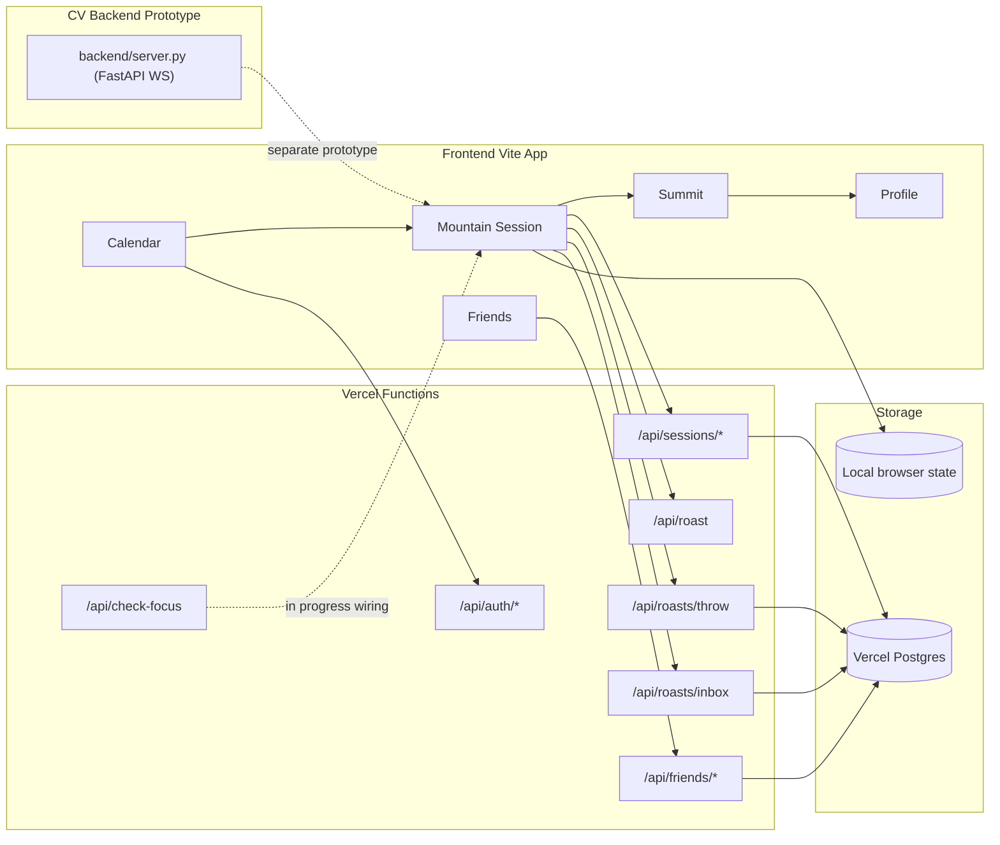

# CompCal

Turn your calendar commitment into a mountain your friends can see.

Built for NYU EEG x Vercel Hackathon (Educational + Social Good).

## Story

Students usually know what they are supposed to study. They have calendar blocks for it. The hard part is follow-through.

CompCal closes that intention-action gap with one loop:

`Plan it -> Check in -> Climb -> Finish with visible outcomes`

Instead of treating productivity as private self-report, CompCal makes progress social and concrete through a shared mountain metaphor.

This project came from a very familiar student failure mode: "my calendar says deep work, but my behavior says drift." We wanted to build something that makes that gap visible without making people feel punished for being human.

Our product principle became:

- accountability should be visible,
- feedback should be gentle,
- recovery should be easy,
- and the system should reward consistency over perfection.

## The Problem

Most productivity tools depend on trust-only inputs:

- Start a timer and walk away.
- Mark a task complete without doing it.
- Tell friends you studied without proof of follow-through.

The result is predictable: plans exist, but completion drops under real-world pressure.

In practice, students do not need another planning interface. They need a bridge between:

- what they committed to,
- what they actually did,
- and what their peers can see.

CompCal focuses on that bridge.

## The Solution

CompCal is a calendar-first accountability experience:

1. Pick a study block from your day.
2. Start a mountain session (solo or with a buddy commitment).
3. Track session progress and periodic focus feedback.
4. End at Summit with outcome metrics (planned vs completed, focus score, kept commitment).
5. View social context in Friends and weekly trend views in Profile.

### Why the mountain metaphor

We do not use the mountain as decoration. We use it as the information architecture:

- altitude maps to progress through the session,
- climbing maps to sustained effort,
- summit maps to commitment completion.

This gives users an emotional read of progress at a glance that plain timers and checklists do not.

## What Is Built Right Now

### Built (working in app)

- Calendar -> Mountain -> Summit -> Profile flow.
- Session timer with check-in, pause/resume, and completion transitions.
- Buddy commitment state and post-session visibility.
- Session outcomes and weekly summaries saved in app state.
- Friends invite/list APIs with Google sign-in based session cookies.
- Google OAuth flow and Calendar-readonly scopes implemented in serverless API routes.
- Focus-check UX controls (enable/disable checks, low-pressure mode, trust messaging).
- Hybrid roast pipeline:
  - auto-trigger roast generation from session context (`/api/roast`),
  - friend-throw delivery over BroadcastChannel for two-tab demo reliability,
  - Postgres-backed throw persistence and inbox polling (`/api/roasts/throw`, `/api/roasts/inbox`).
- Shared mountain rendering with multi-climber trail markers and throw projectile feedback.

### Prototype / In Progress

- Frontend calendar screen still uses fixture data as default for event rendering.
- Focus checks in the current mountain UX are simulated outcomes (no frontend webcam capture wiring yet).
- `api/check-focus` (Anthropic vision scoring) exists, but not fully wired into the main frontend session loop.
- Python FastAPI + MediaPipe eye-tracking WebSocket backend exists separately and is not fully integrated into the frontend flow yet.

### Honest status summary

CompCal today is strongest as:

- a complete interaction loop for commitment tracking,
- a social accountability experience,
- and a transparent trust-first prototype.

It is not yet a fully unified production-grade focus verification pipeline. The verification pieces exist, but full end-to-end wiring is still in progress.

## Product Decisions We Made (And Why)

### 1) Support over punishment

Early versions leaned harsher. We deliberately softened language and added low-pressure controls because fear-based UX can increase avoidance. We want students to restart quickly after drift, not hide from the app.

### 2) Ship one loop, not ten features

We cut a lot of possible scope (multiple progression systems, deeper gamification layers, heavy customization) and focused on one loop that can be demonstrated clearly and judged honestly.

### 3) Build verification as layered signals

Rather than over-claiming one perfect focus detector, we split focus verification into components:

- UI trust controls and periodic check UX in frontend,
- a serverless vision scoring endpoint,
- and a separate eye-tracking backend prototype.

That architecture lets us iterate responsibly while being explicit about confidence limits.

## Architecture



## Tech Stack

- Frontend: React, TypeScript, Vite, Tailwind CSS
- Serverless API: Vercel Functions (`@vercel/node`)
- Data: Vercel Postgres (`@vercel/postgres`)
- Auth/Calendar: Google OAuth + Google Calendar API (readonly scope)
- Vision API route: Anthropic SDK (`@anthropic-ai/sdk`)
- CV backend prototype: Python, FastAPI, MediaPipe, OpenCV

## Vercel Implementation Details

Vercel is the backbone of the deployed web stack in this project: the frontend is built and served as a Vite app, and backend behavior is implemented through serverless routes under `api/` (auth, friends, sessions, and focus scoring). In practice, this means Google OAuth login and callback handling run in Vercel Functions, session identity is stored via HTTP cookies set by those functions, and social/session endpoints read and write persistent state through `@vercel/postgres`. The focus-scoring endpoint (`/api/check-focus`) also runs as a Vercel function, so model calls happen server-side instead of exposing keys in the client. This gives us one deployment surface for UI + APIs while keeping room for the separate Python eye-tracking service as an optional parallel component.

Primary Vercel environment variables used by this architecture:

- `GOOGLE_CLIENT_ID`
- `GOOGLE_CLIENT_SECRET`
- `POSTGRES_URL` (and related Vercel Postgres connection vars)
- `ANTHROPIC_API_KEY`
- `VERCEL_URL` / `VERCEL_PROJECT_PRODUCTION_URL` (used for callback/base URL handling)

## Repo Structure

```text
.
├── api/                    # Vercel serverless endpoints (auth, friends, sessions, focus)
├── frontend/               # React + Vite app
│   ├── docs/               # Demo, focus checks, calendar integration notes
│   └── src/
├── backend/                # Python FastAPI eye-tracking websocket prototype
└── package.json            # Root deps used by /api routes
```

## Local Setup

### Prerequisites

- Node.js 18+
- Python 3.10+

### 1) Install dependencies

```bash
# from repo root
npm install

# frontend deps
cd frontend && npm install

# backend deps
cd ../backend
python -m venv .venv
source .venv/bin/activate
pip install -r requirements.txt
python download_mediapipe_model.py
```

### 2) Run frontend

```bash
cd frontend
npm run dev
```

### 3) Run eye-tracking backend prototype (optional)

```bash
cd backend
source .venv/bin/activate
python server.py
```

WebSocket endpoint: `ws://localhost:8000/ws`

## Environment Notes

For full API functionality, configure environment variables for:

- Google OAuth (`GOOGLE_CLIENT_ID`, `GOOGLE_CLIENT_SECRET`)
- Database connection used by `@vercel/postgres`
- Anthropic API key (for `/api/check-focus`)

## Postgres note for roast events

The friend-throw flow persists roast delivery events in `roast_events`. If your local or hosted database does not include this table yet, apply this SQL:

```sql
CREATE TABLE IF NOT EXISTS roast_events (
  id BIGSERIAL PRIMARY KEY,
  from_user_id TEXT NOT NULL,
  from_name TEXT,
  to_user_id TEXT NOT NULL,
  to_name TEXT,
  session_id TEXT,
  roast_text TEXT NOT NULL,
  trigger_source TEXT NOT NULL DEFAULT 'friend_throw',
  is_read BOOLEAN NOT NULL DEFAULT FALSE,
  created_at TIMESTAMPTZ NOT NULL DEFAULT NOW()
);
```

If these are missing locally, you can still run the frontend prototype flows.

## Demo and Docs

- Frontend implementation notes: [`frontend/README.md`](frontend/README.md)
- Eye-tracking backend protocol: [`backend/README.md`](backend/README.md)
- Demo talk track: [`frontend/docs/DEMO_SCRIPT.md`](frontend/docs/DEMO_SCRIPT.md)
- Focus check behavior: [`frontend/docs/FOCUS_CHECKS.md`](frontend/docs/FOCUS_CHECKS.md)
- Calendar integration plan: [`frontend/docs/CALENDAR_INTEGRATION.md`](frontend/docs/CALENDAR_INTEGRATION.md)

## What We Learned Building This

### Real-time feeling is mostly UX, not just infrastructure

Even without a fully unified real-time backend, careful session-state transitions, progress handling, and visual continuity can make the experience feel alive. Product feel is often the multiplier on technical systems.

### Credibility matters as much as ambition

Hackathon projects often over-claim. We chose to separate built behavior from prototype behavior clearly. Judges and users trust teams that are explicit about what is real now versus what is next.

### Accountability needs consent and control

Focus verification features can become surveillance if poorly framed. We treated controls and transparency as first-class product features, not legal footnotes.

## Why This Matters (Education + Social Good)

CompCal is designed for students who need support for consistency, not punishment. The product emphasizes transparent controls, optional low-pressure mode, and social accountability that encourages recovery after drift instead of shame.

We care about this problem because we are inside the target user group: students balancing heavy workloads, fragmented attention, and social pressure. The goal is not to optimize for "max productivity." The goal is to help more people keep one meaningful commitment each day.

## Roadmap

- Wire real Google Calendar event data directly into the primary session loop.
- Connect `/api/check-focus` to live mountain-session checks.
- Integrate MediaPipe WebSocket signals into the same focus pipeline.
- Move more prototype local persistence to unified backend persistence.
- Expand multiplayer mountain states and cohort-based accountability modes.

## Near-Term Execution Plan

1. Replace fixture-first calendar rendering with authenticated real-event hydration.
2. Add a stable focus-check scheduler contract between frontend session state and `/api/check-focus`.
3. Introduce a merged confidence model that combines periodic vision checks with eye-tracking presence events.
4. Persist all session outcomes server-side and keep local storage as resilience/fallback only.
5. Add reliability instrumentation (request errors, auth expiry, session drop-off points) before broader rollout.

## Team

- Candy Xie - UI, frontend 
- Travis Sim - backend
- Andy Li - design, pitch
- Zachary Galbraith - calendar/auth integration, backend yuh

## Links

- Written Description: [[Docs](https://docs.google.com/document/d/1ph8xvU7aXd4bVt_SnOja5ocCN6N0PLpWgEO2ofITH88/edit?usp=sharing)]
- Demo Video: [[Link](https://www.youtube.com/watch?v=lC2OZYatt8Y)]
