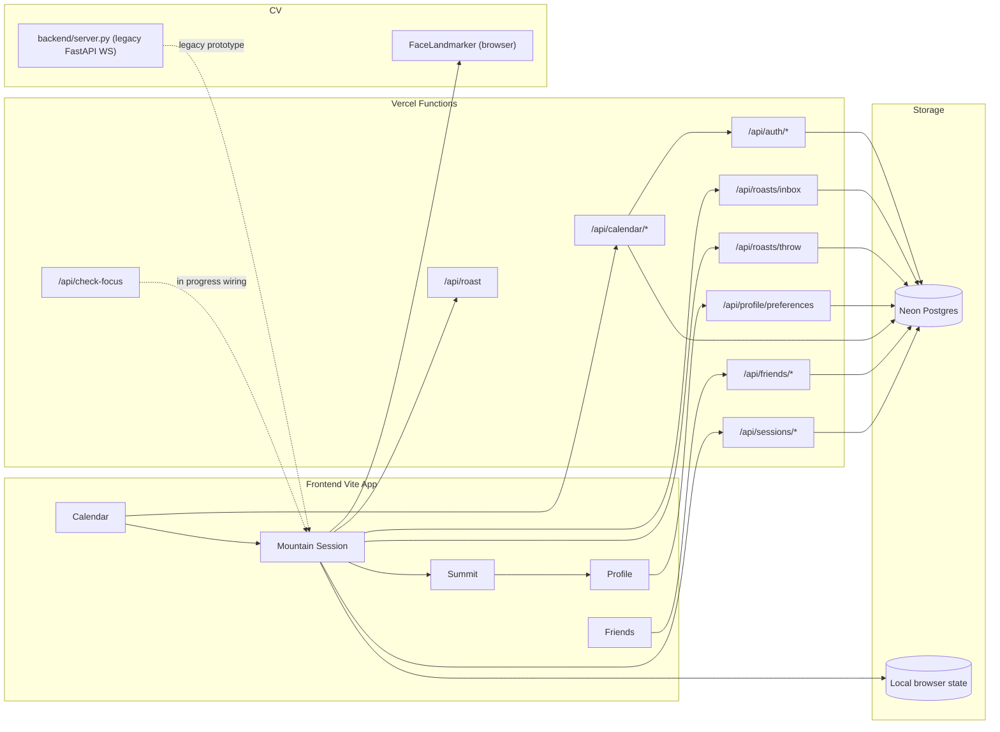

# Calenduel

Turn your calendar commitment into a mountain your friends can see.

Built for NYU EEG x Vercel Hackathon (Educational + Social Good).

## Story

Students usually know what they are supposed to study. They have calendar blocks for it. The hard part is follow-through.

Calenduel closes that intention-action gap with one loop:

`Plan it -> Check in -> Climb -> Finish with visible outcomes`

Instead of treating productivity as private self-report, Calenduel makes progress social and concrete through a shared mountain metaphor.

This project came from a very familiar student failure mode: "my calendar says deep work, but my behavior says drift." We wanted to build something that makes that gap visible without making people feel punished for being human.

Our product principle became:

- accountability should be visible,
- feedback should be gentle,
- recovery should be easy,
- and the system should reward consistency over perfection.

## The Problem

Most productivity tools depend on trust-only inputs:

- Start a timer and walk away.
- Mark a task complete without doing it.
- Tell friends you studied without proof of follow-through.

The result is predictable: plans exist, but completion drops under real-world pressure.

In practice, students do not need another planning interface. They need a bridge between:

- what they committed to,
- what they actually did,
- and what their peers can see.

Calenduel focuses on that bridge.

## The Solution

Calenduel is a calendar-first accountability experience:

1. Pick a study block from your day.
2. Start a mountain session (solo or with a buddy commitment).
3. Track session progress and periodic focus feedback.
4. End at Summit with outcome metrics (planned vs completed, focus score, kept commitment).
5. View social context in Friends and weekly trend views in Profile.

### Why the mountain metaphor

We do not use the mountain as decoration. We use it as the information architecture:

- altitude maps to progress through the session,
- climbing maps to sustained effort,
- summit maps to commitment completion.

This gives users an emotional read of progress at a glance that plain timers and checklists do not.

## What Is Built Right Now

### Built (working in app)

- Calendar -> Mountain -> Summit -> Profile flow.
- Session timer with check-in, pause/resume, and completion transitions.
- Buddy commitment state and post-session visibility.
- Session outcomes and weekly summaries saved in app state and persisted server-side via `/api/sessions/start` and `/api/sessions/end`.
- Google OAuth login (`/api/auth/login`, `/api/auth/callback`, `/api/auth/logout`) with HTTP-only session cookies and AES-256-GCM encrypted refresh tokens at rest.
- Real Google Calendar event fetch through a server-side proxy (`/api/calendar/events`) that uses cached/refreshed access tokens, plus a manual override endpoint (`/api/calendar/override`).
- Gemini-backed academic event classifier (`api/_lib/classify.ts`) that groups raw calendar titles into canonical subjects and persists the result.
- Bidirectional friend system: invite/join links, incoming requests, accept/decline, remove, and revoke (`/api/friends/invite|join|incoming|respond|remove|revoke|list`).
- User profile preferences endpoint (`/api/profile/preferences`).
- Focus-check UX controls (enable/disable checks, low-pressure mode, trust messaging).
- In-browser MediaPipe FaceLandmarker tracker (`frontend/src/lib/use-face-tracker.ts`) detecting eyes-closed and head-turned distraction signals at ~10 fps.
- Hybrid roast pipeline:
  - auto-trigger roast generation from session context (`/api/roast`, Anthropic with deterministic fallback),
  - friend-throw delivery over BroadcastChannel for two-tab demo reliability,
  - Postgres-backed throw persistence and inbox polling (`/api/roasts/throw`, `/api/roasts/inbox`).
- Shared mountain rendering with multi-climber trail markers and throw projectile feedback.
- Idempotent SQL migrations under `migrations/` (001 base schema through 004 friend system polish).

### Prototype / In Progress

- `api/check-focus` runs server-side Gemini vision scoring on captured webcam frames and returns `score | reason`. It is reachable but not yet the primary check trigger inside the mountain session loop.
- Browser FaceLandmarker signals are captured but not yet merged with the server vision score into a single confidence model.
- Python FastAPI + MediaPipe eye-tracking WebSocket backend exists as a legacy prototype and is no longer the active client path: the in-browser tracker is preferred.

### Honest status summary

Calenduel today is strongest as:

- a complete interaction loop for commitment tracking,
- a social accountability experience,
- and a transparent trust-first prototype.

It is not yet a fully unified production-grade focus verification pipeline. The verification pieces exist, but full end-to-end wiring is still in progress.

## Product Decisions We Made (And Why)

### 1) Support over punishment

Early versions leaned harsher. We deliberately softened language and added low-pressure controls because fear-based UX can increase avoidance. We want students to restart quickly after drift, not hide from the app.

### 2) Ship one loop, not ten features

We cut a lot of possible scope (multiple progression systems, deeper gamification layers, heavy customization) and focused on one loop that can be demonstrated clearly and judged honestly.

### 3) Build verification as layered signals

Rather than over-claiming one perfect focus detector, we split focus verification into components:

- UI trust controls and periodic check UX in frontend,
- a serverless vision scoring endpoint,
- and a separate eye-tracking backend prototype.

That architecture lets us iterate responsibly while being explicit about confidence limits.

## Architecture



## Tech Stack

- Frontend: React, TypeScript, Vite, Tailwind CSS
- Browser CV: MediaPipe FaceLandmarker via `@mediapipe/tasks-vision` (eye-aspect-ratio + head pose, runs client-side)
- Serverless API: Vercel Functions (`@vercel/node`)
- Data: Postgres accessed through `@vercel/postgres` (Neon free tier in production, local Docker for development)
- Auth/Calendar: Google OAuth + Google Calendar API (readonly scope), refresh tokens encrypted at rest with AES-256-GCM
- Vision API route: Google Gemini via `@google/generative-ai` (`/api/check-focus`)
- Roast generation: Anthropic SDK (`@anthropic-ai/sdk`), optional with a deterministic fallback when no key is set
- CV backend (legacy prototype): Python, FastAPI, MediaPipe, OpenCV

## Vercel Implementation Details

Vercel is the backbone of the deployed web stack: the frontend is built and served as a Vite app, and backend behavior is implemented through serverless routes under `api/` (auth, friends, sessions, focus scoring, and roasts). Google OAuth login and callback handling run in Vercel Functions, session identity is stored via HTTP cookies set by those functions, and social/session endpoints read and write persistent state through `@vercel/postgres`. Refresh tokens are encrypted at rest with AES-256-GCM before being stored. The focus-scoring endpoint (`/api/check-focus`) calls Gemini server-side so the API key never reaches the browser, and the roast endpoint (`/api/roast`) calls Anthropic server-side with a deterministic fallback when no key is configured. This gives us one deployment surface for UI and APIs while keeping room for the legacy Python eye-tracking service as an optional parallel component.

Primary environment variables used by this architecture (see `.env.example` for the full set):

- `POSTGRES_URL`: Postgres connection string (Neon in production, local Docker for dev)
- `GOOGLE_CLIENT_ID`, `GOOGLE_CLIENT_SECRET`: Google OAuth + Calendar readonly scope
- `GEMINI_API_KEY`: required for `/api/check-focus` and the academic-event classifier
- `ANTHROPIC_API_KEY`: optional, only needed for richer `/api/roast` outputs
- `REFRESH_TOKEN_KEY`: 32-byte hex key for AES-256-GCM encryption of stored refresh tokens (generate with `openssl rand -hex 32`)
- `VERCEL_URL` / `VERCEL_PROJECT_PRODUCTION_URL`: used for OAuth callback and base URL handling

## Repo Structure

```text
.
├── api/                    # Vercel serverless endpoints
│   ├── auth/               # Google OAuth login, callback, logout
│   ├── calendar/           # Server-side Calendar event proxy and overrides
│   ├── friends/            # Invite, join, incoming, respond, remove, revoke, list
│   ├── profile/            # User preferences
│   ├── sessions/           # Session start/end persistence
│   ├── roasts/             # Friend-throw delivery and inbox
│   ├── check-focus.ts      # Gemini vision focus scoring
│   ├── roast.ts            # Anthropic roast generator with deterministic fallback
│   └── _lib/               # cookies, db, session, crypto, google-token, classify
├── frontend/               # React + Vite app
│   ├── docs/               # Demo, focus checks, calendar integration notes
│   └── src/                # Includes lib/use-face-tracker.ts (MediaPipe browser tracker)
├── backend/                # Legacy Python FastAPI eye-tracking WebSocket prototype
├── migrations/             # Idempotent SQL migrations (001 through 004)
├── pitch-deck/             # Static pitch deck and renderer
└── package.json            # Root deps used by /api routes
```

## Local Setup

### Prerequisites

- Node.js 18+
- Python 3.10+

### 1) Install dependencies

```bash
# from repo root
npm install

# frontend deps
cd frontend && npm install

# backend deps
cd ../backend
python -m venv .venv
source .venv/bin/activate
pip install -r requirements.txt
python download_mediapipe_model.py
```

### 2) Run frontend

```bash
cd frontend
npm run dev
```

### 3) Run eye-tracking backend prototype (optional)

```bash
cd backend
source .venv/bin/activate
python server.py
```

WebSocket endpoint: `ws://localhost:8000/ws`

## Environment Notes

Copy `.env.example` to `.env.local` and fill in:

- `POSTGRES_URL` (Neon connection string in production, local Docker for dev)
- Google OAuth (`GOOGLE_CLIENT_ID`, `GOOGLE_CLIENT_SECRET`) with redirect URI `http://localhost:3000/api/auth/callback`
- `GEMINI_API_KEY` (required for `/api/check-focus` and the academic classifier in `api/_lib/classify.ts`)
- `ANTHROPIC_API_KEY` (optional, only needed for richer `/api/roast` outputs; unset uses the deterministic fallback)
- `REFRESH_TOKEN_KEY` (32-byte hex, generate with `openssl rand -hex 32`)

## Database migrations

Apply the SQL files in `migrations/` in order: 001 base schema (users, friendships, sessions), 002 refresh-token storage and event classifications, 003 auth sessions, 004 friend system polish. All files are idempotent (`CREATE TABLE IF NOT EXISTS`), so re-running is safe. The `roast_events` table used by the friend-throw flow is auto-created on first insert by `/api/roasts/throw` and `/api/roasts/inbox`.

## Demo and Docs

- Frontend implementation notes: [`frontend/README.md`](frontend/README.md)
- Eye-tracking backend protocol: [`backend/README.md`](backend/README.md)
- Demo talk track: [`frontend/docs/DEMO_SCRIPT.md`](frontend/docs/DEMO_SCRIPT.md)
- Focus check behavior: [`frontend/docs/FOCUS_CHECKS.md`](frontend/docs/FOCUS_CHECKS.md)
- Calendar integration plan: [`frontend/docs/CALENDAR_INTEGRATION.md`](frontend/docs/CALENDAR_INTEGRATION.md)

## What We Learned Building This

### Real-time feeling is mostly UX, not just infrastructure

Even without a fully unified real-time backend, careful session-state transitions, progress handling, and visual continuity can make the experience feel alive. Product feel is often the multiplier on technical systems.

### Credibility matters as much as ambition

Hackathon projects often over-claim. We chose to separate built behavior from prototype behavior clearly. Judges and users trust teams that are explicit about what is real now versus what is next.

### Accountability needs consent and control

Focus verification features can become surveillance if poorly framed. We treated controls and transparency as first-class product features, not legal footnotes.

## Why This Matters (Education + Social Good)

Calenduel is designed for students who need support for consistency, not punishment. The product emphasizes transparent controls, optional low-pressure mode, and social accountability that encourages recovery after drift instead of shame.

We care about this problem because we are inside the target user group: students balancing heavy workloads, fragmented attention, and social pressure. The goal is not to optimize for "max productivity." The goal is to help more people keep one meaningful commitment each day.

## Roadmap

- Trigger `/api/check-focus` from live mountain-session checks instead of out-of-band test calls.
- Merge browser FaceLandmarker presence signals with the server vision score into a single confidence model.
- Move remaining local-only session state to unified backend persistence with local storage as a fallback.
- Expand multiplayer mountain states and cohort-based accountability modes.
- Add reliability instrumentation (request errors, auth expiry, session drop-off points) before broader rollout.

## Team

- Candy Xie - UI, frontend 
- Travis Sim - backend
- Andy Li - design, pitch
- Zachary Galbraith - calendar/auth integration, backend yuh

## Links

- Written Description: [[Docs](https://docs.google.com/document/d/1ph8xvU7aXd4bVt_SnOja5ocCN6N0PLpWgEO2ofITH88/edit?usp=sharing)]
- Demo Video: [[Link](https://www.youtube.com/watch?v=lC2OZYatt8Y)]
