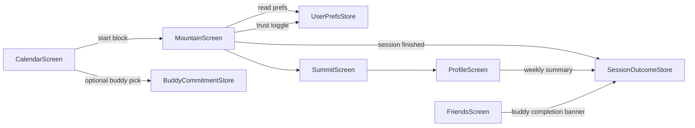

# Demo script (90 seconds)

## Goal sentence

CompCal helps overloaded college students keep one planned study commitment with supportive
peer accountability, without surveillance pressure.

## Talk track

1. **Pain (0:00-0:15)**  
   "Students with burnout or ADHD often know what to do, but cannot stay on one task. They
   need structure and support, not another leaderboard."

2. **Plan and commit (0:15-0:35)**  
   Open Calendar, choose a study block, optionally pick one buddy, then start session.

3. **Focus loop (0:35-0:55)**  
   On Mountain, show timer + focus state. Mention low-pressure mode and focus-check controls.

4. **Outcome and social proof (0:55-1:15)**  
   On Summit, show planned vs completed minutes, distraction checks, kept commitment badge,
   and buddy completion note.

5. **Longitudinal value + trust (1:15-1:30)**  
   On Profile, show weekly kept commitments. Close with "periodic checks only, no continuous
   recording, user can disable checks."

## Architecture narrative

## Real vs mocked for judging honesty

- **Real:** session timing loop, pause/resume, buddy co-commit state, completion persistence,
  weekly outcome summary, trust controls.
- **Mocked:** calendar source, AI assistant intelligence, focus-check inference pipeline.
